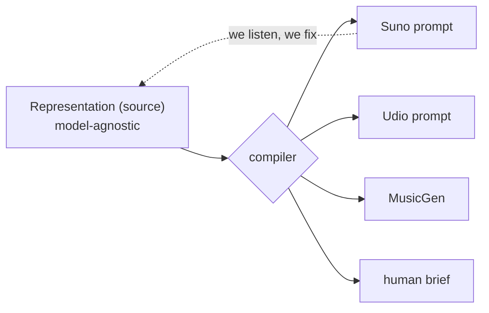

# Le Malentendu

> "Music that never existed."

An **open method** for fusing musical genres. The product is the **method** — a *model-agnostic* representation of a fusion + a compiler — not the audio, not the prompt. The models (Suno, Udio, MusicGen, a human musician) are **interchangeable backends**.

Free, under **AGPLv3**.

## What this is

| | |
|---|---|
| [Genesis](genesis) | How the project was born, in the open |
| [The Method](method) | The spec: 2 layers (sound + text), 3 registers (musicological / felt / political), atoms vs molecules |
| [Political Vision](political-vision) | Six theses: authenticity, commons, creolization, opacity, self-implication, meaning |
| [Examples](examples) | Diagrams + 3 real worked examples |
| [Comparison](comparison) | Why the method beats a raw prompt |
| [Knowledge Graph](/docs/reference/knowledge-graph/overview) | The atoms and crossings — navigable |
| [Catalog](/docs/reference/catalog) | The *found misunderstandings* — beautiful accidents we keep |

## The founding principle

The product = **the method**, not the audio or the prompt. A fusion is described **once**, independently of any model; a compiler renders it to a target.



## Take part

Read the open RFC and **comment on the Pull Request**. Tag your register:
🎼 musicological (a fact) · 👂 felt (subjective) · ✊ political (values).
Disagreement is the point.

## Run the proof

```bash
python3 poc/compile.py          # compile fusions -> Suno + brief
python3 poc/compile.py --check  # self-check
```
