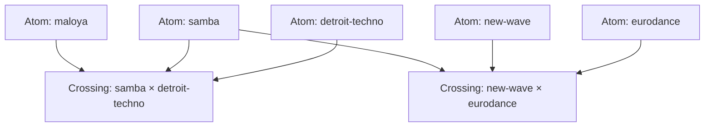

# The Knowledge Graph

The knowledge graph is the living repository of **atoms** (genres) and **crossings** (fusions). It serves three functions:

1. **A store for the compiler** — `compile.py` reads atoms + crossings to produce prompts
2. **A navigable atlas** — browse genres and their fusions below
3. **The sourced musicological layer** — every claim carries a real citation

## Structure

Each **atom** carries:
- **Musicological claims** (register 1) — sourced, falsifiable, agent-fillable
- **Constraints** — constitutive conventions (e.g. fado → Portuguese)
- **Felt** (register 2) — the circle's subjective experience
- **Political** (register 3) — owned, never agent-filled
- **Exemplars** — reference tracks the circle recognizes

Each **crossing** carries:
- Which atoms it fuses, and which is the **frame**
- The **tension** to hold
- What to **avoid**
- The three §6 coherence answers: creolizes, opacity_preserved, self_implication

## Browse

- [All Atoms](atoms) — the genre encyclopedia
- [All Crossings](crossings) — the fusions
