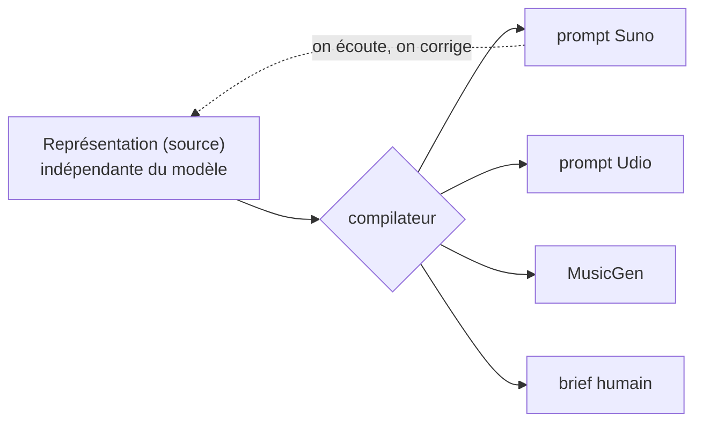
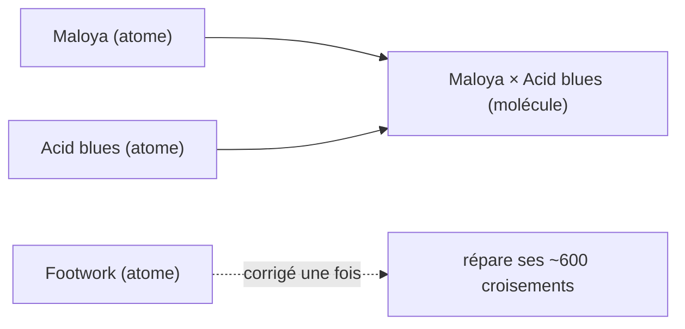
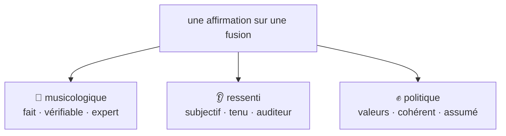
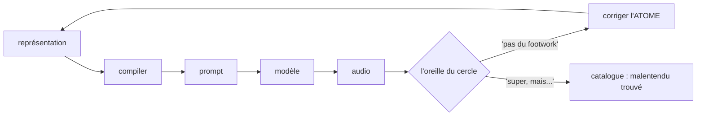
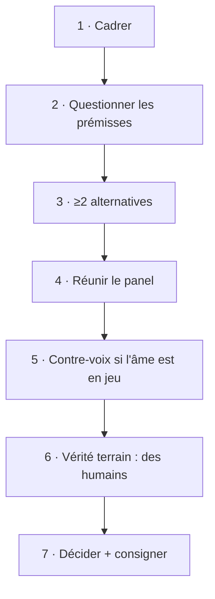

# Le Malentendu — illustré : diagrammes & exemples

## 1. L'architecture : une source, plusieurs backends

Le produit est la **représentation** (la source). Les modèles sont interchangeables. Ce qu'on écoute revient corriger la source — jamais le tuyau.

## 2. Atomes & molécules

On curate les **atomes** (les ~600 genres), pas les molécules (les 360 000 fusions). Corriger un atome répare tous ses croisements d'un coup.

## 3. Les trois registres d'une affirmation

Ne jamais les confondre : un fait, un ressenti et une valeur ne se traitent pas de la même façon.

## 4. La boucle de curation

Le moteur produit ; l'oreille du cercle juge ; la correction revient à la **source**.

## 5. Le processus de décision (7 temps)

---

# Trois exemples réels

## Exemple 1 — Chant grégorien × Footwork : la correction musicologique 🎼

1. **v1 (cliché)** : « 160 bpm, charlestons rapides, voix hachées. »
2. **Retour d'un praticien** (turntabliste) : *« c'est pas du footwork — c'est dépouillé, centré sur le kick, un léger swing hors grille qui donne un groove hypnotique. »*
3. **Corriger l'ATOME footwork** (pas la fusion) → chaque fusion footwork en bénéficie.
4. **Point d'ancrage** : un exemplaire de vérité terrain (un morceau précis, ~1:00), reconnu par le praticien.

> **Ce que ça montre :** registre musicologique (vrai/faux), curation au niveau de l'**atome**, l'exemplaire comme point fixe qui fait *converger* les corrections.

## Exemple 2 — Fado × Dub : la contrainte constitutive ✍️

1. **Sortie** : pas chanté en portugais → *« c'est pas du fado. »*
2. Le fado est **défini par sa langue** → ajouter une **contrainte**, enregistrée comme une **position attribuée** (« selon X »), pas une vérité objective.
3. **Insight backend** : dans Suno, un tag de style « en portugais » est *faible* — la langue est portée par les **paroles**. La couche **texte** porte la langue ; le prompt de style reste en anglais.

> **Ce que ça montre :** les contraintes constitutives, la couche **texte** comme axe à part entière, et `prompt de style ≠ langue chantée`.

## Exemple 3 — Maloya × Acid blues : le malentendu trouvé 👂✊

1. **Sortie** : *« on dirait la Hongrie de l'ère soviétique »* (un auditeur). Le maloya avait disparu.
2. **Deux lectures :**
   - **A — bug = lissage** : une musique de résistance réunionnaise effacée en rock de bloc de l'Est → **test politique n°1** (créolisation vs lissage) échoue.
   - **B — malentendu trouvé** : la machine a entendu la Réunion comme la Hongrie ; personne ne voulait ce contre-sens précis — c'est l'œuvre.
3. **Décision : les deux.** **Renforcer l'atome maloya** (A) *et* **le cataloguer comme MR-001** (B).
4. **Verdict du créateur** : *« Je sais pas si c'est du maloya, mais je trouve le morceau super. »* → le ressenti l'emporte sur la fidélité — mais **ne pas l'étiqueter « maloya ».**

> **Ce que ça montre :** le registre ressenti, le test politique du **lissage**, et la dualité **méthode / catalogue** en action.