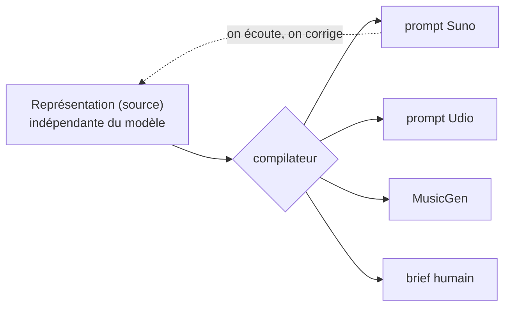

# Le Malentendu

> « Une musique qui n'a jamais existé. »

Une **méthode ouverte** pour fusionner des genres musicaux. Le produit est la **méthode** — une représentation *indépendante du modèle* d'une fusion + un compilateur — pas l'audio, pas le prompt. Les modèles (Suno, Udio, MusicGen, un musicien humain) sont des **backends interchangeables**.

Libre, sous **AGPLv3**.

## Le principe fondateur

Le produit = **la méthode**, pas l'audio ni le prompt. Une fusion est décrite **une seule fois**, indépendamment de tout modèle ; un compilateur la rend vers une cible.



## Cinq contre-voix

Chaque décision qui touche à l'âme du projet passe par des contre-voix — l'axe que l'optimisation startup ne sait pas calculer.

| Contre-voix | Stance | Question forcée |
|---|---|---|
| **Glissant** | créolisation, opacité, Relation | *Créolisation ou smoothie ?* |
| **Debord** | détournement, spectacle, récupération | *Situation vécue, ou accumulation de spectacle ?* |
| **Albini** | métier, deal honnête, le parasite | *Qui se fait avoir ? C'est honnête ?* |
| **Lessig** | communs, le code fait loi, enclosure | *Ça fait croître les communs, ou ça ne fait qu'y puiser ?* |
| **Schaeffer** | l'oreille, l'objet sonore | *Ferme les yeux. Qu'est-ce que tu entends vraiment ?* |

Ce sont des stances IA, pas des simulations de personnes. Elles affûtent ; l'humain décide. Portraits complets : [Personas](personas).

## Ce qu'on y trouve

| | |
|---|---|
| [Genèse](genesis) | Comment le projet est né, à découvert |
| [La Méthode](method) | La spec : 2 couches (son + texte), 3 registres (musicologique / ressenti / politique), atomes vs molécules |
| [Vision politique](political-vision) | Six thèses, chacune portée par une contre-voix |
| [Exemples](examples) | Diagrammes + 3 exemples concrets |
| [Comparaison](comparison) | Pourquoi la méthode bat un prompt brut |
| [Personas](personas) | Les cinq contre-voix et le processus de décision |
| [Graphe de connaissances](/docs/reference/knowledge-graph/overview) | Les atomes et croisements — navigables |
| [Catalogue](/docs/reference/catalog) | Les *malentendus trouvés* — les beaux accidents qu'on garde |

## Participer

Lisez le RFC ouvert et **commentez sur la Pull Request**. Tagguez votre registre :
🎼 musicologique (un fait) · 👂 ressenti (subjectif) · ✊ politique (valeurs).
Le désaccord est le sujet.

## Lancer la preuve

```bash
python3 poc/compile.py          # compiler les fusions -> Suno + brief
python3 poc/compile.py --check  # auto-vérification
```
