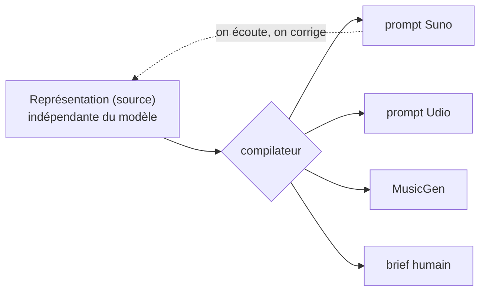
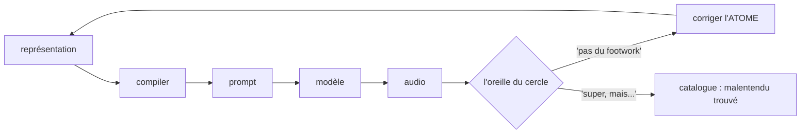

# La Méthode — modèle de représentation

> Spec **vivante**. C'est ici qu'on affine le modèle ; le PoC l'implémente une fois la spec stabilisée.

## 0. Principe fondateur

Le produit = **la méthode**, pas l'audio ni le prompt. Une fusion est décrite **une seule fois**, indépendamment de tout modèle ; un compilateur la rend vers une cible. **Suno / Udio / MusicGen / un musicien humain = backends interchangeables.**

## 1. Deux couches

Une fusion n'est pas que du son — c'est aussi des mots, et **le texte fusionne aussi** (latin liturgique sur un kick séculier ; saudade portugaise sur du dub). Deux couches à parts égales :

- **Son** : groove, harmonie, instrumentation, production, tempo/feeling, tension.
- **Texte** : langue, thèmes/contenu, concept/détournement, paroles (sortie compilée, dans la langue requise).

## 2. Trois registres

Chaque affirmation (son ou texte) appartient à un registre. Les confondre est l'erreur à éviter.

| Registre | Nature | Source | Falsifiable | Rôle au rendu |
|---|---|---|---|---|
| **musicologique** | fait structurel (tempo, mode, instrumentation, traits du genre, langue/convention) | musicologue / praticien expert | oui (vrai/faux) | contraintes |
| **ressenti** | expérience subjective (beau, « ça marche », reconnaissance, émotion) | tout auditeur | non (tenu, pas vrai) | intention / ambiance |
| **politique** | valeurs / vision du monde (ce que le geste dit) | une position assumée, attribuée | non, mais doit être **cohérent** | sens / choix structurels |

## 3. Attribution — des positions, pas des vérités

Chaque affirmation porte sa **source**. Le musicologique peut être vrai ou faux (un expert tranche) ; le ressenti et le politique sont *tenus*, pas vrais. Un atome de genre = un faisceau de **positions attribuées**, contestables. Deux curateurs peuvent diverger : le moteur garde les deux.

## 4. Atomes & molécules

- **Atome** = un genre. Porte : description (par registre), **contraintes** (conventions, ex. fado→portugais), **exemplaires** (morceaux de référence + qui les reconnaît). Corriger un atome corrige **toutes** ses fusions.
- **Molécule** = une fusion de deux atomes.

Le levier de curation est l'**atome** (~600 genres), pas la molécule (360 000 fusions). Un Footwork mal défini empoisonne ses 600 croisements ; corrigé une fois, il les répare tous.

## 5. Garde-fous

- **Son** : cohérence musicologique (un expert).
- **Texte** : plagiat, contenu explicite, imitation d'artiste réel, prononciation, authenticité vocale.

## 6. La vision politique (registre 3)

> **Texte intégral :** [Vision politique](political-vision)

Salle des machines, pas paroles. Incarnée dans les croisements, la licence, la contrefaçon — presque jamais dite.

- **L'authenticité = un rapport de pouvoir** : on contrefait le réel pour exposer qu'il est *certifié*, pas essentiel.
- **Contre l'enclosure, pour les communs** : moteur libre, AGPL.
- **Créolisation, pas lissage** : friction fertile contre le smoothie / le slop.
- **Droit à l'opacité** : l'inclassable contre la lisibilité totale ; l'illisibilité comme résistance.
- **Pas de dehors propre — auto-implication** : on utilise les armes de l'ennemi et on le dit.
- **Le sens plutôt que le contenu** : l'oreille humaine contre le débit.

**Deux tests de cohérence** (par croisement / texte) :
1. Est-ce que ça **créolise** (friction fertile) ou ça **lisse** (slop) ?
2. Est-ce que ça **préserve l'opacité** (irréductible) ou ça **livre la culture à la machine** (extraction propre) ?

## 7. Deux méta-garde-fous

- **La forme, pas le sermon.** La politique vit dans le geste, pas dans des paroles moralisatrices.
- **L'oreille juge, pas la théorie.** Une cohérence qui ne *sonne* pas bien est morte. Le cercle décide de la qualité ; Glissant ne sauvera pas un morceau ennuyeux.

## 8. Le panel de curateurs (par registre)

- **musicologique** → un musicologue / praticien expert.
- **ressenti** → le cercle des auditeurs.
- **texte** → paroliers + garde-fous.
- **politique** → l'auteur : la vision est assumée et attribuée.

Processus de décision complet : [Personas](personas).