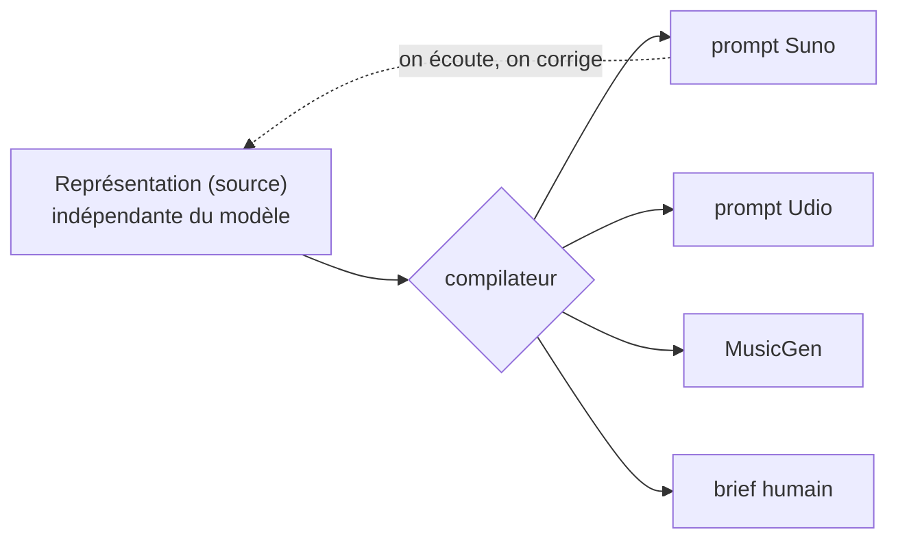

# Le Malentendu

> « Une musique qui n'a jamais existé. »

Une **méthode ouverte** pour fusionner des genres musicaux. Le produit est la **méthode** — une représentation *indépendante du modèle* d'une fusion + un compilateur — pas l'audio, pas le prompt. Les modèles (Suno, Udio, MusicGen, un musicien humain) sont des **backends interchangeables**.

Libre, sous **AGPLv3**.

## Ce qu'on y trouve

| | |
|---|---|
| [Genèse](genesis) | Comment le projet est né, à découvert |
| [La Méthode](method/core) | La spec : 2 couches (son + texte), 3 registres (musicologique / ressenti / politique), atomes vs molécules |
| [Vision politique](method/political-vision) | Six thèses : authenticité, communs, créolisation, opacité, auto-implication, sens |
| [Exemples](method/examples) | Diagrammes + 3 exemples concrets |
| [Comparaison](method/comparison) | Pourquoi la méthode bat un prompt brut |
| [Graphe de connaissances](knowledge-graph/overview) | Les atomes et croisements — navigables |
| [Catalogue](catalogue/misunderstandings) | Les *malentendus trouvés* — les beaux accidents qu'on garde |

## Le principe fondateur

Le produit = **la méthode**, pas l'audio ni le prompt. Une fusion est décrite **une seule fois**, indépendamment de tout modèle ; un compilateur la rend vers une cible.



## Participer

Lisez le RFC ouvert et **commentez sur la Pull Request**. Tagguez votre registre :
🎼 musicologique (un fait) · 👂 ressenti (subjectif) · ✊ politique (valeurs).
Le désaccord est le sujet.

## Lancer la preuve

```bash
python3 poc/compile.py          # compiler les fusions -> Suno + brief
python3 poc/compile.py --check  # auto-vérification
```

---

*non = malentendu*
