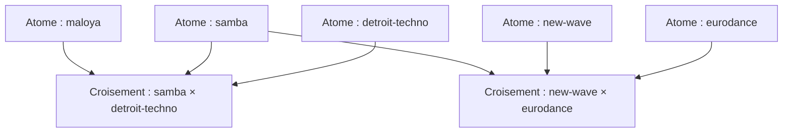

# Le graphe de connaissances

Le graphe de connaissances est le dépôt vivant des **atomes** (genres) et des **croisements** (fusions). Il remplit trois fonctions :

1. **Un magasin pour le compilateur** — `compile.py` lit atomes + croisements pour produire des prompts
2. **Un atlas navigable** — parcourez les genres et leurs fusions ci-dessous
3. **La couche musicologique sourcée** — chaque affirmation porte une citation réelle

## Structure

Chaque **atome** porte :
- **Affirmations musicologiques** (registre 1) — sourcées, falsifiables, remplissables par agent
- **Contraintes** — conventions constitutives (ex. fado → portugais)
- **Ressenti** (registre 2) — l'expérience subjective du cercle
- **Politique** (registre 3) — assumé, jamais rempli par l'agent
- **Exemplaires** — morceaux de référence reconnus par le cercle

Chaque **croisement** porte :
- Quels atomes il fusionne, et lequel est le **cadre**
- La **tension** à tenir
- L'**intention** (registre 4) — le projet déclaré du créateur pour cette fusion
- Ce qu'il faut **éviter**
- Les trois réponses de cohérence §6 : créolise, opacité préservée, auto-implication

## Parcourir

- [Tous les atomes](atoms) — l'encyclopédie des genres
- [Tous les croisements](crossings) — les fusions
