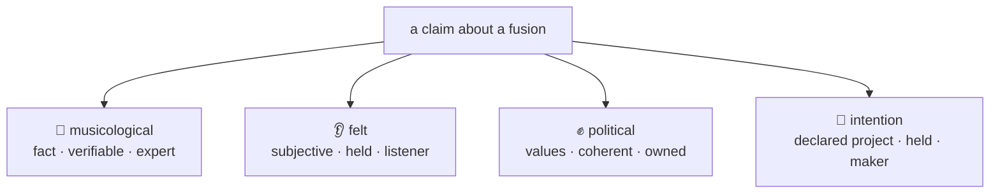
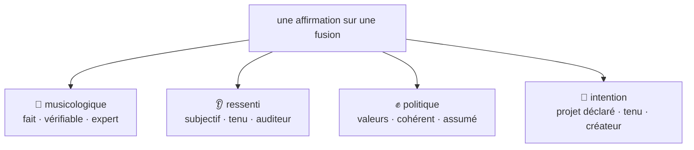

# Intention Register Implementation Plan

> **For agentic workers:** REQUIRED SUB-SKILL: Use superpowers:subagent-driven-development (recommended) or superpowers:executing-plans to implement this plan task-by-task. Steps use checkbox (`- [ ]`) syntax for tracking.

**Goal:** Add the intention register (🎯) as the 4th register throughout all documentation (EN + FR).

**Architecture:** Pure documentation change — no code. Every file that references "three registers" or lists the register table needs updating. Changes are grouped by conceptual unit (the method spec, the examples, the knowledge graph, etc.), each touching its EN + FR pair.

**Tech Stack:** Markdown, Mermaid diagrams, Python type stubs (in schema.md)

**Key distinction:** The existing `tension` field on crossings ("the artistic intent that must survive") is **not** the intention register. `tension` is a render-time constraint; `intention` is the maker's declared project — broader, attributed, held. They coexist.

---

### Task 1: The Method — register table, attribution, curator roster (EN + FR)

**Files:**
- Modify: `docs-site/docs/explanation/method.md:35-39` (register table)
- Modify: `docs-site/docs/explanation/method.md:41-43` (§3 attribution)
- Modify: `docs-site/docs/explanation/method.md:88-93` (§8 curator roster)
- Modify: `docs-site/i18n/fr/docusaurus-plugin-content-docs/current/explanation/method.md:35-39`
- Modify: `docs-site/i18n/fr/docusaurus-plugin-content-docs/current/explanation/method.md:41-43`
- Modify: `docs-site/i18n/fr/docusaurus-plugin-content-docs/current/explanation/method.md:88-93`

- [ ] **Step 1: Update EN register table (§2)**

In `docs-site/docs/explanation/method.md`, change the section title and add the intention row to the table:

```markdown
## 2. Four registers

Every claim (sound or text) belongs to a register. Conflating them is the error to avoid.

| Register | Nature | Source | Falsifiable | Role at render |
|---|---|---|---|---|
| **musicological** | structural fact (tempo, mode, instrumentation, genre traits, language/convention) | musicologist / expert practitioner | yes (true/false) | constraints |
| **felt** (*ressenti*) | subjective experience (beautiful, "it works", recognition, emotion) | any listener | no (held, not true) | intent / mood |
| **political** | values / worldview (what the gesture says) | an owned, attributed position | no, but must be **coherent** | meaning / structural choices |
| **intention** | declared project (what the maker wants to accomplish with the fusion) | the maker / alternative curator | no (held, declarative) | direction / brief |
```

- [ ] **Step 2: Update EN attribution (§3)**

In the same file, update §3 to mention intention:

```markdown
## 3. Attribution — positions, not truths

Every claim carries its **source**. The musicological can be true or false (an expert decides); the felt, the political, and the intention are *held*, not true. A genre atom = a bundle of **attributed positions**, contestable. Two curators may diverge: the engine holds both.
```

- [ ] **Step 3: Update EN curator roster (§8)**

In the same file, add the intention curator:

```markdown
## 8. The curator roster (by register)

- **musicological** → a musicologist / expert practitioner.
- **felt** → the circle of listeners.
- **text** → lyricists + guardrails.
- **political** → the author: the vision is owned and attributed.
- **intention** → the maker (default); alternative curators can hold a different intention.
```

- [ ] **Step 4: Update FR register table (§2)**

In `docs-site/i18n/fr/docusaurus-plugin-content-docs/current/explanation/method.md`, change the section title and add the intention row:

```markdown
## 2. Quatre registres

Chaque affirmation (son ou texte) appartient à un registre. Les confondre est l'erreur à éviter.

| Registre | Nature | Source | Falsifiable | Rôle au rendu |
|---|---|---|---|---|
| **musicologique** | fait structurel (tempo, mode, instrumentation, traits du genre, langue/convention) | musicologue / praticien expert | oui (vrai/faux) | contraintes |
| **ressenti** | expérience subjective (beau, « ça marche », reconnaissance, émotion) | tout auditeur | non (tenu, pas vrai) | intention / ambiance |
| **politique** | valeurs / vision du monde (ce que le geste dit) | une position assumée, attribuée | non, mais doit être **cohérent** | sens / choix structurels |
| **intention** | projet déclaré (ce que le créateur veut accomplir avec la fusion) | le créateur / curateur alternatif | non (tenu, déclaratif) | direction / brief |
```

- [ ] **Step 5: Update FR attribution (§3)**

```markdown
## 3. Attribution — des positions, pas des vérités

Chaque affirmation porte sa **source**. Le musicologique peut être vrai ou faux (un expert tranche) ; le ressenti, le politique et l'intention sont *tenus*, pas vrais. Un atome de genre = un faisceau de **positions attribuées**, contestables. Deux curateurs peuvent diverger : le moteur garde les deux.
```

- [ ] **Step 6: Update FR curator roster (§8)**

```markdown
## 8. Le panel de curateurs (par registre)

- **musicologique** → un musicologue / praticien expert.
- **ressenti** → le cercle des auditeurs.
- **texte** → paroliers + garde-fous.
- **politique** → l'auteur : la vision est assumée et attribuée.
- **intention** → le créateur (par défaut) ; d'autres curateurs peuvent porter une intention différente.
```

- [ ] **Step 7: Commit**

```bash
git add docs-site/docs/explanation/method.md docs-site/i18n/fr/docusaurus-plugin-content-docs/current/explanation/method.md
git commit -m "docs: add intention register to method spec (EN + FR)"
```

---

### Task 2: Examples — register diagram (EN + FR)

**Files:**
- Modify: `docs-site/docs/explanation/examples.md:33-42` (§3 diagram)
- Modify: `docs-site/i18n/fr/docusaurus-plugin-content-docs/current/explanation/examples.md:33-42`

- [ ] **Step 1: Update EN register diagram (§3)**

In `docs-site/docs/explanation/examples.md`, update the section title and Mermaid diagram:

```markdown
## 3. The four registers of a claim

Never conflate them: a fact, a feeling, a value and a project aren't handled the same way.



- [ ] **Step 2: Update FR register diagram (§3)**

In `docs-site/i18n/fr/docusaurus-plugin-content-docs/current/explanation/examples.md`:

```markdown
## 3. Les quatre registres d'une affirmation

Ne jamais les confondre : un fait, un ressenti, une valeur et un projet ne se traitent pas de la même façon.



- [ ] **Step 3: Commit**

```bash
git add docs-site/docs/explanation/examples.md docs-site/i18n/fr/docusaurus-plugin-content-docs/current/explanation/examples.md
git commit -m "docs: add intention register to examples diagrams (EN + FR)"
```

---

### Task 3: Intro — register summary (EN + FR)

**Files:**
- Modify: `docs-site/docs/explanation/intro.md:48` (table row)
- Modify: `docs-site/docs/explanation/intro.md:58-59` (register tags)
- Modify: `docs-site/i18n/fr/docusaurus-plugin-content-docs/current/explanation/intro.md:48`
- Modify: `docs-site/i18n/fr/docusaurus-plugin-content-docs/current/explanation/intro.md:58-59`

- [ ] **Step 1: Update EN intro**

In `docs-site/docs/explanation/intro.md`, update the table row:

```markdown
| [The Method](method) | The spec: 2 layers (sound + text), 4 registers (musicological / felt / political / intention), atoms vs molecules |
```

And the register tags:

```markdown
Read the open RFC and **comment on the Pull Request**. Tag your register:
🎼 musicological (a fact) · 👂 felt (subjective) · ✊ political (values) · 🎯 intention (a project).
```

- [ ] **Step 2: Update FR intro**

In `docs-site/i18n/fr/docusaurus-plugin-content-docs/current/explanation/intro.md`, update the table row:

```markdown
| [La Méthode](method) | La spec : 2 couches (son + texte), 4 registres (musicologique / ressenti / politique / intention), atomes vs molécules |
```

And the register tags:

```markdown
Lisez le RFC ouvert et **commentez sur la Pull Request**. Tagguez votre registre :
🎼 musicologique (un fait) · 👂 ressenti (subjectif) · ✊ politique (valeurs) · 🎯 intention (un projet).
```

- [ ] **Step 3: Commit**

```bash
git add docs-site/docs/explanation/intro.md docs-site/i18n/fr/docusaurus-plugin-content-docs/current/explanation/intro.md
git commit -m "docs: add intention register to intro (EN + FR)"
```

---

### Task 4: Comparison — register mentions (EN + FR)

**Files:**
- Modify: `docs-site/docs/explanation/comparison.md:19` (row 4)
- Modify: `docs-site/i18n/fr/docusaurus-plugin-content-docs/current/explanation/comparison.md:19`

- [ ] **Step 1: Update EN comparison**

In `docs-site/docs/explanation/comparison.md`, no change needed — row 4 says "its register" (singular, generic), row "Intent" references `tension` which is a different concept. Leave as-is.

Verify: re-read the file and confirm no reference to "three registers" exists.

- [ ] **Step 2: Update FR comparison**

Same check for `docs-site/i18n/fr/docusaurus-plugin-content-docs/current/explanation/comparison.md`.

- [ ] **Step 3: Commit (skip if no changes)**

Only commit if changes were made.

---

### Task 5: Knowledge Graph overview — register list (EN + FR)

**Files:**
- Modify: `docs-site/docs/reference/knowledge-graph/overview.md:27-30`
- Modify: `docs-site/i18n/fr/docusaurus-plugin-content-docs/current/reference/knowledge-graph/overview.md`

- [ ] **Step 1: Update EN overview**

In `docs-site/docs/reference/knowledge-graph/overview.md`, add intention to the atom's register list:

```markdown
Each **atom** carries:
- **Musicological claims** (register 1) — sourced, falsifiable, agent-fillable
- **Constraints** — constitutive conventions (e.g. fado → Portuguese)
- **Felt** (register 2) — the circle's subjective experience
- **Political** (register 3) — owned, never agent-filled
- **Exemplars** — reference tracks the circle recognizes

Each **crossing** carries:
- Which atoms it fuses, and which is the **frame**
- The **tension** to hold
- The **intention** (register 4) — the maker's declared project for this fusion
- What to **avoid**
- The three §6 coherence answers: creolizes, opacity_preserved, self_implication
```

- [ ] **Step 2: Update FR overview**

In `docs-site/i18n/fr/docusaurus-plugin-content-docs/current/reference/knowledge-graph/overview.md`:

```markdown
Chaque **atome** porte :
- **Affirmations musicologiques** (registre 1) — sourcées, falsifiables, remplissables par agent
- **Contraintes** — conventions constitutives (ex. fado → portugais)
- **Ressenti** (registre 2) — l'expérience subjective du cercle
- **Politique** (registre 3) — assumé, jamais rempli par l'agent
- **Exemplaires** — morceaux de référence reconnus par le cercle

Chaque **croisement** porte :
- Quels atomes il fusionne, et lequel est le **cadre**
- La **tension** à tenir
- L'**intention** (registre 4) — le projet déclaré du créateur pour cette fusion
- Ce qu'il faut **éviter**
- Les trois réponses de cohérence §6 : créolise, opacité préservée, auto-implication
```

- [ ] **Step 3: Commit**

```bash
git add docs-site/docs/reference/knowledge-graph/overview.md docs-site/i18n/fr/docusaurus-plugin-content-docs/current/reference/knowledge-graph/overview.md
git commit -m "docs: add intention register to knowledge graph overview (EN + FR)"
```

---

### Task 6: Crossings — add intention field (EN + FR)

**Files:**
- Modify: `docs-site/docs/reference/knowledge-graph/crossings.md`
- Modify: `docs-site/i18n/fr/docusaurus-plugin-content-docs/current/reference/knowledge-graph/crossings.md`

- [ ] **Step 1: Update EN crossings**

In `docs-site/docs/reference/knowledge-graph/crossings.md`, add the `intention` row to the structure table, after `tension`:

```markdown
| Field | Purpose |
|-------|---------|
| `atoms` | The two genres being fused |
| `frame_from` | Which atom dominates the groove |
| `tension` | The artistic intent that must survive |
| `intention` | The maker's declared project for this fusion (register 4, held) |
| `avoid` | What to exclude (derived from past failures) |
| `creolizes` | How it creates fertile friction (not flattening) |
| `opacity_preserved` | How it preserves irreducibility |
| `self_implication` | The owned answer to "is this extraction?" |
```

- [ ] **Step 2: Update FR crossings**

In `docs-site/i18n/fr/docusaurus-plugin-content-docs/current/reference/knowledge-graph/crossings.md`:

```markdown
| Champ | Rôle |
|-------|------|
| `atoms` | Les deux genres fusionnés |
| `frame_from` | Quel atome domine le groove |
| `tension` | L'intention artistique qui doit survivre |
| `intention` | Le projet déclaré du créateur pour cette fusion (registre 4, tenu) |
| `avoid` | Ce qu'il faut exclure (dérivé des échecs passés) |
| `creolizes` | Comment ça crée de la friction fertile (pas du lissage) |
| `opacity_preserved` | Comment ça préserve l'irréductibilité |
| `self_implication` | La réponse assumée à « est-ce de l'extraction ? » |
```

- [ ] **Step 3: Commit**

```bash
git add docs-site/docs/reference/knowledge-graph/crossings.md docs-site/i18n/fr/docusaurus-plugin-content-docs/current/reference/knowledge-graph/crossings.md
git commit -m "docs: add intention field to crossings reference (EN + FR)"
```

---

### Task 7: Schema RFC — add intention to models (EN + FR)

**Files:**
- Modify: `docs-site/docs/reference/schema.md`
- Modify: `docs-site/i18n/fr/docusaurus-plugin-content-docs/current/reference/schema.md`

- [ ] **Step 1: Update EN schema**

In `docs-site/docs/reference/schema.md`, add `intention` to the `Crossing` model and to `Exemplar` (if defined). Update the `Crossing` class:

```python
class Crossing(BaseModel):
    crossing: str
    atoms: tuple[str, str]
    frame_from: str
    tension: str
    intention: list[HeldClaim]    # register 4 — the maker's declared project, held
    avoid: str | None
    creolizes: str            # §6 coherence test
    opacity_preserved: str    # §6 coherence test
    self_implication: str     # owned answer
    held_by: list[str]
```

Also add a note under "Key decisions":

```markdown
4. **The intention register (register 4) is held, like felt and political.** The maker's declared project for a fusion — not falsifiable, not constraining at render. Lives on crossings (design intention) and exemplars (execution intention).
```

- [ ] **Step 2: Update FR schema**

In `docs-site/i18n/fr/docusaurus-plugin-content-docs/current/reference/schema.md`, the Crossing model is not shown (the FR schema only shows Atom). Add it:

After the Atom class block, add:

```python
class Crossing(BaseModel):
    crossing: str
    atoms: tuple[str, str]
    frame_from: str
    tension: str
    intention: list[HeldClaim]    # registre 4 — projet déclaré du créateur, tenu
    avoid: str | None
    creolizes: str
    opacity_preserved: str
    self_implication: str
    held_by: list[str]
```

Also add a note under "Décisions clés":

```markdown
4. **Le registre intention (registre 4) est tenu, comme le ressenti et le politique.** Le projet déclaré du créateur pour une fusion — pas falsifiable, pas contraignant au rendu. Vit sur les croisements (intention de design) et les exemplaires (intention d'exécution).
```

- [ ] **Step 3: Commit**

```bash
git add docs-site/docs/reference/schema.md docs-site/i18n/fr/docusaurus-plugin-content-docs/current/reference/schema.md
git commit -m "docs: add intention register to schema RFC (EN + FR)"
```

---

### Task 8: Listening sheet — add 🎯 line (EN + FR)

**Files:**
- Modify: `docs-site/docs/how-to/send-listening-sheet.md:22-26`
- Modify: `docs-site/i18n/fr/docusaurus-plugin-content-docs/current/how-to/send-listening-sheet.md`

- [ ] **Step 1: Update EN listening sheet**

In `docs-site/docs/how-to/send-listening-sheet.md`, add the intention line after the three existing register prompts:

```markdown
**🎼 The ear** — Do you recognise [Genre A]? [Genre B]? What sounds right or wrong in the fusion?

**👂 The feeling** — What does it evoke? What does it do to you?

**✊ The stance** — Does it take a position on something? Too much? Not enough? Not readable?

**🎯 The intention** — What do you think this fusion is trying to do? Does it land?
```

Update the count line:

```markdown
Answer one question if you like — or all four. There's no right answer, only yours.
```

- [ ] **Step 2: Update FR listening sheet**

In `docs-site/i18n/fr/docusaurus-plugin-content-docs/current/how-to/send-listening-sheet.md`:

```markdown
**🎼 L'oreille** — Vous reconnaissez [Genre A] ? [Genre B] ? Qu'est-ce qui sonne juste ou faux dans la fusion ?

**👂 Le ressenti** — Qu'est-ce que ça évoque ? Qu'est-ce que ça vous fait ?

**✊ La position** — Est-ce que ça prend position sur quelque chose ? Trop ? Pas assez ? Pas lisible ?

**🎯 L'intention** — D'après vous, cette fusion essaie de faire quoi ? Est-ce que ça arrive ?
```

Update the count line:

```markdown
Répondez à une question si vous voulez — ou aux quatre. Il n'y a pas de bonne réponse, seulement la vôtre.
```

- [ ] **Step 3: Commit**

```bash
git add docs-site/docs/how-to/send-listening-sheet.md docs-site/i18n/fr/docusaurus-plugin-content-docs/current/how-to/send-listening-sheet.md
git commit -m "docs: add intention register to listening sheet template (EN + FR)"
```

---

### Task 9: Build verification

- [ ] **Step 1: Run Docusaurus build**

```bash
cd docs-site && npm run build
```

Expected: clean build, no broken links.

- [ ] **Step 2: Spot-check Mermaid renders**

Start dev server, navigate to `/docs/explanation/examples`, verify the 4-register diagram renders with the 🎯 node.

- [ ] **Step 3: Commit (skip — nothing to commit)**
